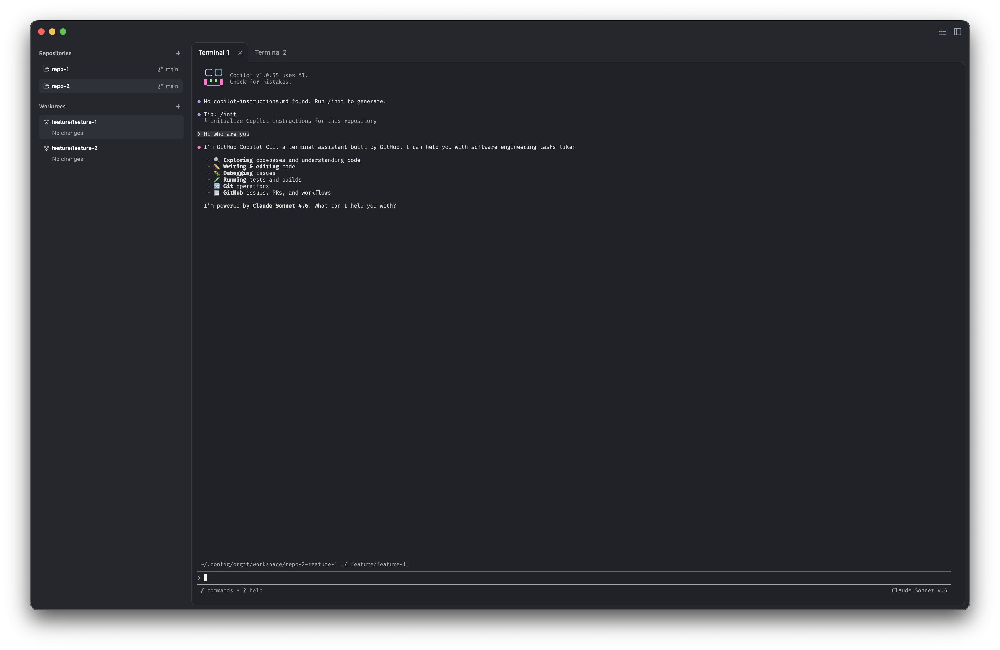

# Orgit

**A desktop control center for Git workspaces** — one place to see your repositories, linked worktrees, and changes, with integrated terminals built in.

Orgit is designed for teams and individuals who juggle several checkouts of the same codebase: feature branches as worktrees, quick visibility into what diverged from main, and a focused environment to run commands without leaving the app.



---

## Why Orgit

Modern Git workflows often mean more than one checkout per repository. Orgit turns that complexity into a clear, navigable workspace:

- **Scan once, work everywhere** — Point Orgit at a folder; it discovers repository roots and every linked worktree automatically.
- **See impact at a glance** — Per-worktree diff stats (files changed, lines added and removed) against main’s committed state help you decide what needs attention.
- **Stay in context** — Select a repository, pick a worktree, open a terminal tab scoped to that checkout. Switch branches without losing session history.
- **Operate with confidence** — Git and disk access stay in a secure main process; the UI is a thin, reactive layer you can reason about.

---

## Capabilities

| Area | What you get |
| ---- | ------------ |
| **Workspace** | Configurable root directory; repositories are detected as top-level Git roots under that path. |
| **Repositories** | Sidebar list with current branch; select a repo to drive the rest of the UI. |
| **Worktrees** | Linked checkouts per repo with change indicators; selections persist across sessions. |
| **Terminal** | Multiple tabs per worktree, Dracula-style theming, WebGL-backed rendering for responsive TUIs. |
| **Logs** | Built-in tail of the application log for support and debugging. |
| **Preferences** | Terminal font, colors, and scrollback via `~/.config/orgit/config.json`. |

---

## Getting started

### Requirements

- [Bun](https://bun.sh) (runtime and package manager)
- macOS (primary target; other platforms may work with Electrobun but are not the focus today)

### Run from source

```bash
git clone https://github.com/lnans/orgit.git
cd orgit
bun install
bun run dev:hmr
```

On first launch, Orgit uses `~/.config/orgit/workspace` as the default scan directory. Add your Git repository roots there (each repo as a direct child folder with a `.git` directory).

### Configuration

User settings and persisted selections live under `~/.config/orgit/`. See the [development guide](./doc/development.md#workspace-on-disk) for paths and [`config.example.json`](./config.example.json) for terminal appearance options.

---

## Documentation

Technical documentation for architecture, project layout, and contribution workflows lives in **[`doc/`](./doc/README.md)**.

| Guide | Description |
| ----- | ----------- |
| [Architecture](./doc/architecture.md) | Main vs webview, RPC, state, and startup |
| [Project structure](./doc/project-structure.md) | Source tree and feature conventions |
| [Development](./doc/development.md) | Commands, local paths, build notes |
| [Contributing features](./doc/contributing.md) | End-to-end checklist for new domains |

---

## Technology

Orgit is built with [Electrobun](https://electrobun.dev), [Bun](https://bun.sh), [React 19](https://react.dev), [Tailwind CSS 4](https://tailwindcss.com), and [xterm.js](https://xtermjs.org) — a native shell around a modern web UI, with Git executed only in the main process.

---

## License

See [LICENSE](./LICENSE).
